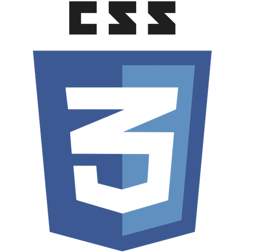
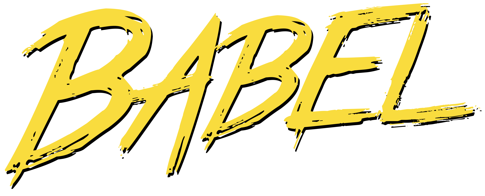

# React Boiler Plate  

A highly scalable, offline-first foundation with the best DX and a focus on performance and best practices.  

Build on the latest tech stacks:  

            

Deliver high quality code with:  

     Sinon.JS expect enzyme
